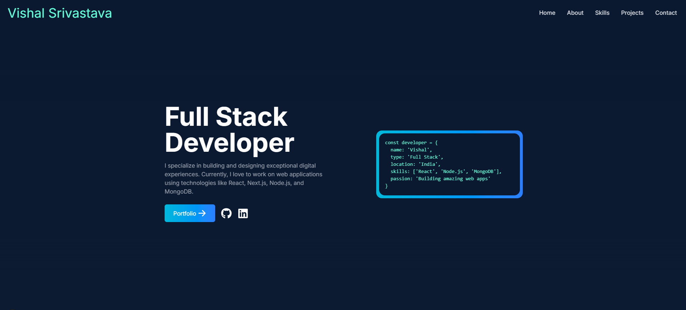

# My Portfolio Website

A modern, responsive portfolio website built with Next.js, Tailwind CSS, and Framer Motion. This website showcases my skills, projects, and professional experience as a Full Stack Developer.

## 🛠️ Built With

- [Next.js]
- [Tailwind CSS]
- [Framer Motion]
- [React Icons]
- [TypeScript]

## 🤝 Contact

Vishal Srivastava - [LinkedIn](https://linkedin.com/in/vishal0902) - [GitHub](https://github.com/vishal0902)

